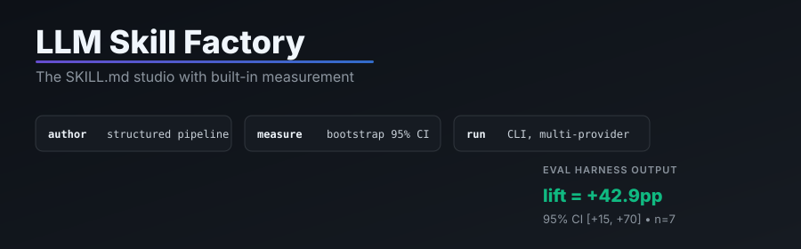
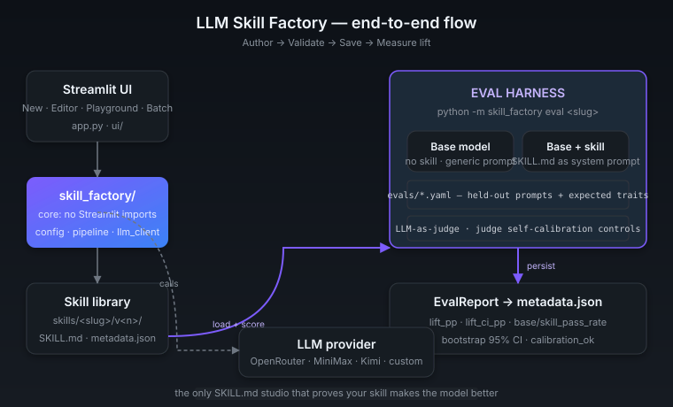

<div align="center">

# 🏭 LLM Skill Factory

**The SKILL.md studio with built-in measurement.**
Author, validate, version, and *prove* that your skill makes the model better — with bootstrap confidence intervals.

[](https://github.com/Mine-FNL/LLM-Skill-Factory-Tool/actions)
[](tests/)
[](tests/)
[](LICENSE)
[](https://www.python.org/downloads/)
[](CHANGELOG.md)

<p align="center">
  
</p>

</div>

---

> **The pitch in one sentence.** A SKILL.md is the open standard for modular AI expertise — a folder with a markdown file at the root that turns a general-purpose LLM into a specialist. **LLM Skill Factory is the only authoring tool that ships with an eval harness.** Every skill you author can be measured: base model vs. base+skill, on a held-out prompt set, with bootstrap 95% CI. You don't ship on vibes.

<p align="center">
  
</p>

---

## Skills that have been measured

A table generated from any `metadata.json` with a real `lift_pp` field. To populate it:

```bash
# Save a real eval against your saved skill.
python -m skill_factory eval <slug> --save

# Regenerate this table.
python scripts/render_measured_skills.py
```

<!-- BEGIN MEASURED-SKILLS -->
<!-- Run `python scripts/render_measured_skills.py` to refresh. -->
_No skills have been measured yet. Run `python -m skill_factory eval <slug> --save` against a saved skill to populate this table._
<!-- END MEASURED-SKILLS -->

> Real measured lift numbers are the most valuable contribution to this project. The `eval-report` issue template makes sharing them back easy.

---

## Why this exists

SKILL.md went GA on the Claude Platform in August 2026 and is now adopted across Claude Code, the Claude API, ChatGPT, OpenAI Codex, and the broader agent ecosystem. A skill is a folder — `SKILL.md` at the root plus optional `scripts/`, `references/`, `assets/`. The format is open, the discovery is filesystem-based, and the leverage is huge: a well-authored skill makes the same model dramatically better at a specific kind of work.

But there are two problems nobody solves:

1. **Authoring is artisanal.** Existing tools hand you a blank markdown file. The result depends entirely on your prompt-engineering intuition.
2. **Nobody measures whether the skill actually helps.** The whole pitch is "skills make models better" — but nobody runs the A/B.

LLM Skill Factory fixes both. It ships:
- A **structured generation pipeline** (spec → outline → draft → refine → validate → save) with a meta-skill that encodes best-practice rules for the model to follow.
- A **filesystem-first versioned library** (every skill is plain `SKILL.md` + `metadata.json`, git-friendly and inspectable).
- An **eval harness** (`python -m skill_factory eval <slug>`) that measures the lift of any skill over the base model with a bootstrap 95% CI.

## Why this is different

| | LLM Skill Factory | Anthropic's own authoring guide | Promptfoo | LangChain prompt templates |
|---|---|---|---|---|
| Generates SKILL.md | ✓ multi-stage pipeline + meta-skill | ✗ (docs only) | ✗ | ✗ |
| Validates against the open spec | ✓ (frontmatter, kebab-case, trigger-rich description) | ✓ | ✗ | ✗ |
| **Measures skill lift over base model** | **✓ bootstrap 95% CI** | ✗ | ✓ generic evals | ✗ |
| Versioned, filesystem-first storage | ✓ | ✗ | ✗ | ✗ |
| Hierarchical skills (base + overlays) | ✓ batch generator | ✓ | ✗ | partial |
| Multi-provider (OpenRouter, MiniMax, Kimi, custom) | ✓ | n/a | ✓ | ✓ |
| Ships a working Streamlit UI | ✓ | ✗ | partial | ✗ |
| Pure-core, no Streamlit imports (CLI + library use) | ✓ | n/a | ✓ | partial |
| Production-ready Docker image + healthcheck | ✓ | ✗ | ✗ | ✗ |

The single differentiator that nobody else has: **the eval harness**. Anthropic's own tooling ships example skills but no way to measure them. Promptfoo measures generic prompt quality but doesn't understand the SKILL.md format or run the comparison in the way that matters (base vs. base+skill, on prompts the skill is supposed to help with).

---

## Quickstart

> New to Python or the command line? Follow the gentler **[step-by-step guide → INSTALL.md](INSTALL.md)**.

```bash
# 1. Install
pip install -e ".[dev]"

# 2. Configure a key (any of these)
export OPENROUTER_API_KEY=sk-or-...     # aggregator — best for trying many models
# export MINIMAX_API_KEY=...
# export MOONSHOT_API_KEY=...

# 3. Run the Streamlit UI
streamlit run app.py
```

Then open the app, go to **Config**, pick a provider, paste a key, and head to **New Skill**. ~2 minutes to your first skill.

### 60-second "does it work?" check

```bash
# 1. No API key — see the full eval pipeline run end-to-end with realistic synthetic data.
make demo
```

If that prints a lift summary + a calibration panel, the harness is wired correctly. Then for a real run:

```bash
# 2. With your key — runs the actual eval against a real model.
export OPENROUTER_API_KEY=sk-or-...
python -m skill_factory eval <your-skill> --save

# 3. Close the dev loop: load a saved skill and run it against a real prompt.
python -m skill_factory run <slug> --prompt "..." --model anthropic/claude-sonnet-4.6
```

The `run` subcommand loads any saved skill and invokes it as a system prompt against a real model — the moment between "I authored a skill" and "I see it work on a real prompt."

---

## Features

- **Eval harness with bootstrap 95% CI** — measure any skill against the base model on a held-out prompt set. Persists to `metadata.json`. The headline differentiator.
- **`skill-factory run`** — load any saved skill and invoke it against a real model from the CLI. Closes the dev loop (`python -m skill_factory run <slug> --prompt "..."`).
- **Multi-stage generation pipeline** with approval gates: *spec → outline → draft → refine → validate → save*.
- **Skill types**: domain-expert, specialist, workflow, hybrid.
- **Hierarchical skills** with a base skill plus specialist **overlays**.
- **Batch generator** that produces one overlay per entity from a base skill (JSON preset or pasted list).
- **Versioned, filesystem-first library** — every skill is plain `SKILL.md` + `metadata.json`, git-friendly and inspectable.
- **Editor** with live markdown preview, best-practice **validator**, and targeted LLM "refine this section".
- **Multi-provider**: OpenRouter, MiniMax, Kimi/Moonshot, or any custom OpenAI-compatible endpoint. Switch in the UI; keys remembered per provider.
- **Testing playground** that runs a skill as a system prompt against any model and records thumbs/notes.
- **Reference material ingestion**: paste text or upload files (`.txt`/`.md`; `.pdf` when `pypdf` is available).
- **Export**: download a skill as a zip (with a usage guide) or copy it into another app.

---

## Measuring a skill (eval harness)

```bash
# Dry-run: show what would be evaluated without any LLM calls.
python -m skill_factory eval backend-api-engineer --dry-run

# Full run with the default model; persist the report into metadata.json.
python -m skill_factory eval backend-api-engineer --save

# Pin the model + use a separate judge model.
python -m skill_factory eval qnb-specialist \
    --eval-set financial-statement-analyst \
    --model anthropic/claude-sonnet-4.6 \
    --judge-model anthropic/claude-sonnet-4.6 \
    --save
```

Output:

```
▶ evaluating 'backend-api-engineer' v1 on 'backend-api-engineer' (7 prompts)…

  eval set : backend-api-engineer (n=7)
  eval model: anthropic/claude-sonnet-4.6
  judge     : anthropic/claude-sonnet-4.6

  base pass  :   42.9%
  skill pass :   85.7%
  lift       :  +42.9pp
  95% CI     : [+15.0, +70.0]pp (bootstrap n=1000)

  prompt_id                       base skill  lift
  ----------------------------------------------------
  idempotency-on-money-move          ✗     ✓   +100
  pagination-at-scale                ✗     ✓   +100
  ...
  ✓ lift > 0
```

> **Note on the example above.** Numbers shown are *illustrative*, not measured. The eval harness shipped in v0.3.0; the first real measurement is pending. Run the 60-second smoke test above to produce your own number, or `--save` an eval against your saved skill to persist it.

Three reference eval sets ship in [`evals/`](evals/): `backend-api-engineer` (7 prompts), `quant-research-analyst` (6), `financial-statement-analyst` (6), plus a 2-prompt `demo` set for fast verification. Add your own YAMLs — the schema is small, see the shipped sets for the shape.

### Judge self-calibration

The eval harness ships with a **judge self-check** to catch miscalibration before you trust a lift number. Each eval set can declare `controls:` — prompts where you *know* what the right score is (e.g. a prompt that's deliberately impossible should score 0). The runner warns if the judge consistently over- or under-scores against the controls, so a broken judge can never silently inflate the lift.

---

## Production deployment

This project ships a hardened image. Run it however you prefer:

```bash
# Container (recommended): non-root user, multi-stage build, in-tree HEALTHCHECK.
docker build -t skill-factory:0.3 .
docker run --rm -p 8501:8501 \
    -e LLM_PROVIDER=openrouter \
    -e OPENROUTER_API_KEY=sk-or-... \
    skill-factory:0.3

# Bare metal / venv
pip install -e .
streamlit run app.py

# CLI version + health probe
python -m skill_factory               # prints the version
python -m skill_factory healthcheck   # full check (exit 0 = ready)
```

What "production-ready" means here (full detail in [`SECURITY.md`](SECURITY.md) and [`ARCHITECTURE.md`](ARCHITECTURE.md)):

| Concern              | Implementation                                                                                                    |
|----------------------|-------------------------------------------------------------------------------------------------------------------|
| API call resilience  | Configurable timeout + retry with exponential backoff + jitter on transient HTTP / network failures (`LLMClient`).|
| Typed errors         | `RetryableLLMError` distinguishes transient from permanent failures for the UI / batch runner.                    |
| Input limits         | Hard size caps on reference text (`SF_MAX_REF_TEXT_BYTES`, default 200 KB) and uploads (default 5 MB).             |
| Path safety          | Reserved-slug protection (Windows device names, `.`, `..`), path-traversal guard, kebab-case enforcement.         |
| Logging              | stdlib `logging` via `skill_factory.logging_setup`; JSON format for container aggregators.                        |
| Health probe         | `python -m skill_factory.healthcheck` — Docker `HEALTHCHECK`-compatible, JSON output, `--strict` for prod.        |
| Container hardening  | Multi-stage `Dockerfile`, non-root user (`uid 10001`), `HEALTHCHECK` directive wired to the in-tree module.        |
| CI                   | GitHub Actions: ruff + pytest matrix on Python 3.10 / 3.11 / 3.12 + Docker build smoke.                          |
| Dependency updates   | Dependabot configured for pip + GitHub Actions, weekly, grouped.                                                  |

### Operational knobs

All environment variables with sensible defaults; you don't need to set them unless your deployment differs.

| Env var                     | Purpose                                            | Default |
|-----------------------------|----------------------------------------------------|---------|
| `LLM_PROVIDER`              | `openrouter` / `minimax` / `kimi` / `custom`       | `openrouter` |
| `LLM_TIMEOUT`               | Per-request HTTP timeout in seconds                | `60`    |
| `LLM_MAX_RETRIES`           | Retry attempts (exponential backoff + jitter)      | `3`     |
| `SF_MAX_REF_TEXT_BYTES`     | Reject oversized pasted / uploaded reference text  | `204800` (200 KB) |
| `SF_MAX_UPLOAD_BYTES`       | Reject oversized file uploads                      | `5242880` (5 MB) |
| `SF_MAX_NAME_LEN`           | Reject oversized skill slugs                       | `64`    |
| `SKILL_FACTORY_LOG_LEVEL`   | `DEBUG` / `INFO` / `WARNING` / `ERROR`             | `WARNING` |
| `SKILL_FACTORY_LOG_FORMAT`  | `plain` or `json`                                  | `plain` |
| `SKILLS_DIR`                | Where skills are written                           | `./skills` |
| `SF_EVALS_DIR`              | Where eval-set YAMLs live                          | `./evals` |

### Auth

The Streamlit app is **single-tenant**. If you expose it beyond localhost, put it behind your existing reverse-proxy / auth layer (nginx, oauth2-proxy, Cloudflare Access, etc.). Out of the box the app binds to `0.0.0.0:8501` and trusts any client that can reach the port.

---

## Development

```bash
make dev               # pip install -e ".[dev,pdf]"
make lint              # ruff check
make format            # ruff format
make test              # pytest
make test-cov          # pytest + coverage
make typecheck         # mypy on skill_factory/
```

The core package [`skill_factory/`](skill_factory/) contains all logic and has **no Streamlit imports**, so it's fully unit-testable and reusable outside the UI. The Streamlit layer lives in [`ui/`](ui/) and [`app.py`](app.py). The eval package lives in [`skill_factory/eval/`](skill_factory/eval/) and is fully CLI-driven.

### Contributing

See [`CONTRIBUTING.md`](CONTRIBUTING.md) for the dev workflow and commit conventions. The highest-leverage contributions right now are **new reference eval sets** (drop a YAML in `evals/`), **real measured lift numbers** from running evals against shipped skills, and **judge self-calibration prompts** that catch common failure modes.

---

## Roadmap (deferred)

The interfaces/seams for these are in place; they were intentionally left for follow-up:

- **Bundle authoring** — generate the full skill folder (SKILL.md + `scripts/` + `references/` + `assets/`), not just SKILL.md.
- **Distribution CLI** — `skill-factory install <skill> --target ~/.claude/skills/` or `--target api` (upload to Skills API).
- **Run command** — `skill-factory run --skill <slug> --prompt "..."` for a one-liner skill invocation. ✓ (shipped in v0.4)
- **Public skill registry** — push/pull skills, search, fork, rate.
- **Activation test harness** — measure description precision/recall against positive + negative trigger phrases.

## Related projects (in the SKILL.md ecosystem)

These are real, sibling repos in the Mine-FNL org + adjacent. Each of them is the kind of project this tool was built to author or measure:

- **[Mine-FNL/grok-skills](https://github.com/Mine-FNL/grok-skills)** — 18 production-ready SKILL.md packs for Grok Build (code review, debugging, security, etc.). This is the first real-world consumer of the SKILL.md format in this org.
- **[delzarsolutionsllc/grok-custom-skills](https://github.com/delzarsolutionsllc/grok-custom-skills)** — an external collection of reusable Grok-compatible agent skills, forked from Stijnman's original. Same ecosystem, same format.
- **[Mine-FNL/fnl-fusion-releases](https://github.com/Mine-FNL/fnl-fusion-releases)** — public release artifacts for the FNL Fusion installers (Falcon Nest-adjacent).
- **[Mine-FNL/qstocks-filing-tool](https://github.com/Mine-FNL/qstocks-filing-tool)** — jurisdiction-agnostic PDF → lossless filing JSON (companion tool that operates on a different but adjacent problem).

If you maintain a SKILL.md pack or a similar agent-skills collection, open an issue or PR — we'd love to add it here, and we'd love to use this tool to measure your packs.

## License

MIT — see [LICENSE](LICENSE).
